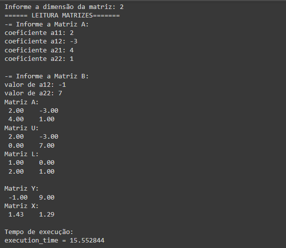

# Fatoração LU
Código feito para solução de sistemas lineares com fatoração LU

# Modo de usar
- Primeiro você deve colocar os valores do seu sistema dentro de um arquivo excel
- O arquivo deve conter 2 planilhas dentro dele:
  - uma planilha com o nome "A":
    - Essa deve conter os coeficientes dos sistemas em forma de matriz
    - exemplo:
      - Sistema:
        ```
        { 4x + 3y + 2z = 10
        { x + 6y + 3z = 5
        { 5x + 7y + 9z = 20
        ```
      - Coeficientes na planilha "A":
        | A | B | C |
        | :---: | :---: | :---: |
        | 4 | 3 | 2 |
        | 1 | 6 | 3 |
        | 5 | 7 | 9 |
  - uma planilha com o nome "B":
    - Essa deve conter os termos independentes do sistema em forma de coluna
    - exemplo:
      - Usaremos o mesmo sistema:
        ```
        { 4x + 3y + 2z = 10
        { x + 6y + 3z = 5
        { 5x + 7y + 9z = 20
        ```
      - termos independentes na planilha "B":
        | A |
        | :---: | 
        | 10 |
        | 5 |
        | 20 |

- Agora basta executar o código no mesmo diretório onde se encontrar o arquivo excel

# Exemplo do código funcionando

